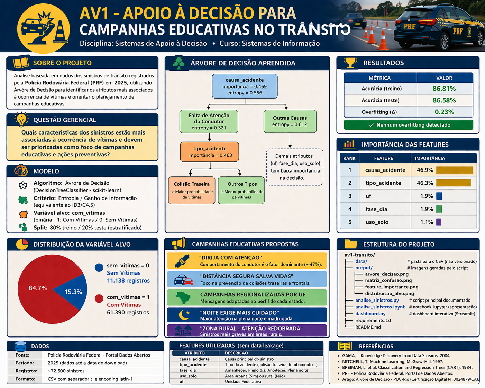

# AV1 - Apoio à Decisão para Campanhas Educativas no Trânsito

**Disciplina:** Sistemas de Apoio à Decisão  
**Curso:** Sistemas de Informação

---



---

## Apresentação

[](https://youtu.be/t1Wmm8guo5g)

---

## Sobre o Projeto

Análise baseada em dados dos sinistros de trânsito registrados pela **Polícia Rodoviária Federal (PRF)** em 2025, utilizando **Árvore de Decisão** para identificar os atributos mais associados à ocorrência de vítimas e orientar o planejamento de campanhas educativas.

**Questão gerencial:**
> *Quais características dos sinistros estão mais associadas à ocorrência de vítimas e devem ser priorizadas como foco de campanhas educativas e ações preventivas?*

---

## Modelo

- **Algoritmo:** Árvore de Decisão (`DecisionTreeClassifier` - scikit-learn)
- **Critério:** Entropia / Ganho de Informação (equivalente ao ID3/C4.5)
- **Variável alvo:** `com_vitimas` (binária - 1: Com Vítimas / 0: Sem Vítimas)
- **Split:** 80% treino / 20% teste (estratificado)

### Resultados

| Métrica | Valor |
|---|---|
| Acurácia (treino) | 86.81% |
| Acurácia (teste) | 86.58% |
| Overfitting | Nenhum (Δ = 0.23%) |

### Importância das Features

| Rank | Feature | Importância |
|---|---|---|
| 1 | `causa_acidente` | ~46.9% |
| 2 | `tipo_acidente` | ~46.3% |
| 3 | `uf` | ~1.9% |
| 4 | `fase_dia` | ~1.9% |
| 5 | `uso_solo` | ~1.1% |

---

## Estrutura do Projeto

```
av1-transito/
├── data/                        # pasta para o CSV (não versionado)
├── output/                      # imagens geradas pelo script
│   ├── arvore_decisao.png
│   ├── matriz_confusao.png
│   ├── feature_importance.png
│   └── distribuicao_alvo.png
├── analise_sinistros.py         # script principal documentado
├── analise_sinistros.ipynb      # notebook Jupyter (apresentação)
├── dashboard.py                 # dashboard interativo (Streamlit)
├── requirements.txt
└── README.md
```

---

## Como Executar

### 1. Clonar o repositório

```bash
git clone https://github.com/dgomp/av1-transito.git
cd "av1-transito"
```

### 2. Criar e ativar ambiente virtual

```bash
# Windows
python -m venv venv
venv\Scripts\activate

# Linux / macOS
python3 -m venv venv
source venv/bin/activate
```

### 3. Instalar dependências

```bash
pip install -r requirements.txt
```

### 4. Obter os dados

Acesse o Portal de Dados Abertos do Governo Federal e faça o download do arquivo de sinistros de trânsito da PRF agrupados por ocorrência, ano 2025:

- https://dados.gov.br/dados/conjuntos-dados/sinistros-de-transito-agrupados-por-ocorrencia

Salve o arquivo como `datatran2025.csv` na raiz do projeto (ou dentro de `data/`).

> É necessário autenticação gov.br para realizar o download.

### 5. Executar

```bash
# Script Python
python analise_sinistros.py

# Ou notebook interativo (local)
jupyter notebook analise_sinistros.ipynb

# Ou dashboard interativo
streamlit run dashboard.py
```

#### Alternativa: Google Colab

Abra o `analise_sinistros.ipynb` diretamente no [Google Colab](https://colab.research.google.com/). Na célula de carregamento dos dados, o notebook detecta automaticamente o ambiente e exibe um botão de upload — selecione o `datatran2025.csv` do seu computador.

> Para usar o Google Drive em vez do upload, descomente as linhas `drive.mount` na mesma célula e ajuste o caminho do arquivo.

Os gráficos serão salvos automaticamente na pasta `output/`.

> No dashboard, o modelo é retreinado automaticamente ao ajustar os hiperparâmetros (`max_depth` e `min_samples_leaf`) via sliders na barra lateral.

---

## Dados

| Item | Detalhe |
|---|---|
| Fonte | Polícia Rodoviária Federal - Portal Dados Abertos |
| Período | 2025 (dados até a data de download) |
| Registros | ~72.500 sinistros |
| Formato | CSV com separador `;` e encoding `latin-1` |

> O arquivo CSV **não é versionado** no repositório por conta do tamanho. Siga as instruções acima para obtê-lo.

---

## Features Utilizadas

Apenas atributos **sem data leakage** (sem usar mortos, feridos, etc):

| Feature | Descrição |
|---|---|
| `causa_acidente` | Causa principal do sinistro |
| `tipo_acidente` | Tipo (colisão traseira, tombamento, atropelamento…) |
| `fase_dia` | Amanhecer / Pleno dia / Anoitecer / Plena noite |
| `condicao_metereologica` | Chuva, céu claro, nublado… |
| `tipo_pista` | Simples, dupla ou múltipla |
| `tracado_via` | Reta, curva, declive, aclive… |
| `uso_solo` | Área urbana (Sim) ou rural (Não) |
| `sentido_via` | Crescente / Decrescente |
| `dia_semana` | Dia da semana |
| `uf` | Unidade Federativa |

---

## Campanhas Propostas

Com base nos atributos de maior importância identificados pelo modelo:

1. **"Dirija com Atenção"** - comportamento do condutor é o fator dominante (~47%)
2. **"Distância Segura Salva Vidas"** - prevenção de colisões traseiras e frontais
3. **Campanhas Regionalizadas por UF** - adaptadas ao perfil de cada estado
4. **"Noite Exige Mais Cuidado"** - plena noite e madrugada
5. **"Zona Rural - Atenção Redobrada"** - sinistros mais graves em áreas rurais

---

## Referências

- GAMA, J. *Knowledge Discovery from Data Streams*, 2004.
- MITCHELL, T. *Machine Learning*, McGraw-Hill, 1997.
- BREIMAN, L. et al. *Classification and Regression Trees (CART)*, 1984.
- PRF - Polícia Rodoviária Federal. Portal de Dados Abertos.
- Artigo: *Árvore de Decisão* - PUC-Rio (Certificação Digital Nº 0024879/CA).